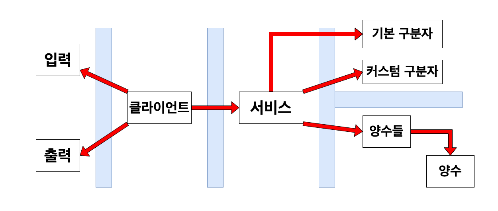

# 개념과 격벽
> - **개념은 자동차 경주 프로그램을 지탱하는 것들**
> - **외부 라이브러리(Console, Random)는 개념이라 보기 어려움**
- 자동차: 1급 개념
  - 이름: 상태
    - 식별자 역할, 즉 고유한 값이어야 함
  - 위치: 상태
    - 핵심 개념 경주에 영향을 주는 상태 값
  - 움직임(전진 or 멈춤): 행위, 위치(상태)에 영향
- 자동차들: 2급 개념
- 경주: 1급 개념
  - 라운드(차수): 상태
  - 차수 결과: 상태
  - 경주 진행: 행위, 자동차들에 움직임 요청해 차수 결과(상태)에 영향
- 조율: 2급 개념
  - 자동차 경주 개념들 조율
- 출력: 2급 개념
  - 형식: 변하지 않는 상태(상수)
  - 출력 형식을 지키지 않으면 실패
- 랜덤값: 3급 개념
  - 외부 라이브러리 `Randoms` 사용 -> 완벽한 제어/통제 불가능
  - 완벽하게 제어하고 통제할 수 있는 요소: 랜덤값의 범위
- 입력: 3급 개념 
  - 외부 라이브러리 `Console` 사용 -> 완벽한 제어/통제 불가능
  - 완벽하게 제어하고 통제할 수 있는 요소: 자원 해제, 기본 입력 형식(null, empty, blank)



# 기능 요구 사항 분석
- 주어진 횟수 동안 n대의 자동차는 전진 또는 멈출 수 있다.
  - 자동차는 스스로 움직임(전진/멈춤)
  - 자동차들에게 움직임(전진/멈춤)을 명령한다 -> 핵심 개념
- 각 자동차에 이름을 부여할 수 있다. 전진하는 자동차를 출력할 때 자동차 이름을 같이 출력한다.
- 자동차 이름은 쉼표(,)를 기준으로 구분하며 이름은 5자 이하만 가능하다.
  - 쉼표를 기준으로 구분하는 것은 Presentation Layer 책임
  - 이름이 5자 이하인지 검증하는것은 이름과 관련된 도메인의 책임
  - 이름에 공백을 포함? 이름에 이모지를 포함? -> 일종의 게임 닉네임
- 사용자는 몇 번의 이동을 할 것인지를 입력할 수 있어야 한다.
  - 너무 많은 자동차와 너무 많은 횟수 -> 몇 개 까지 제한하고, 몇 번 까지 제한할까? 
- 전진하는 조건은 0에서 9 사이에서 무작위 값을 구한 후 무작위 값이 4 이상일 경우이다.
  - 무작위 값은 외부 API(`Randoms.pickNumberInRange()`) 호출 -> 내가 제어/통제할 수 없는 요소
  - 내가 제어/통제할 수 있는 부분은 4 이상일 경우를 판단하는 부분
- 자동차 경주 게임을 완료한 후 누가 우승했는지를 알려준다. 우승자는 한 명 이상일 수 있다.
- 우승자가 여러 명일 경우 쉼표(,)를 이용하여 구분한다.
- 사용자가 잘못된 값을 입력할 경우 IllegalArgumentException을 발생시킨 후 애플리케이션은 종료되어야 한다.
  - `IllegalArgumentException`: 부적절한 인수가 전달, 부적절한 인수를 누가 만들었나(누구의 책임: 사용자 or 개발자)?
    - 사용자: 빈 문자열, 공백으로 이루어진 문자열, 5자 초과
    - 개발자: null, 인수 타입에 맞지 않는 데이터 전달(컴파일 시점에 막을 수 있음) 
- 입력: 경주할 자동차 이름(이름은 쉼표(,) 기준으로 구분), 시도할 횟수
  - 이름을 쉼표 기준으로 구분한다는 것을 입력에서 알려주고 있음 -> 도메인 규칙이라 보기 애매함
  - 쉼표를 기준으로 구분해 넘겨주는 것은 입력, 즉 Presentation Layer 책임으로 도메인에서 진행할 필요가 없음
- 출력: 차수별 실행 결과, 우승자 안내 문구(단독 or 공동)
    - `String.join()` 활용
    - 차수별 실행 결과를 출력할 때, 차수별 결과를 바로 넘겨 출력 or 모든 차수가 끝난 후 결과를 넘겨 출력
    - 일반적인 애플리케이션은 어떻게 할까? 후자를 선택하면 DB 처럼 사용하는 저장소가 필요함
```text
경주할 자동차 이름을 입력하세요.(이름은 쉼표(,) 기준으로 구분)
pobi,woni,jun
시도할 횟수는 몇 회인가요?
5

실행 결과
pobi : -
woni : 
jun : -

pobi : --
woni : -
jun : --

pobi : ---
woni : --
jun : ---

pobi : ----
woni : ---
jun : ----

pobi : -----
woni : ----
jun : -----

최종 우승자 : pobi, jun
```

# 프로그래밍 요구 사항 분석
- 프로그램 실행의 시작점이 `Application.main()`이어야 하는 이유
  - `ApplicationTest.runMain()`이 호출, 즉 다른 곳에서 시작하면 ApplicationTest 무조건 실패
  - 그래서 명시하지 않은 파일, 패키지 이름을 변경하면 안됨
  - 시작점의 책임은? Java 프로그램이 시작하려면 어떤 것들이 필요한가?
  - System.exit() 호출하지 않는 이유는 [문자열 덧셈기 문서](https://github.com/ykmxxi/java-calculator-7/blob/ykmxxi/docs/concept_bulkhead.md)
- indent depth 3이 넘지 않도록 구현한다, 2까지만 허용
  - 왜 indent depth를 2로 제한할까?
- 왜 3항 연산자를 쓰지 않을까?
- 함수(또는 메서드)가 한 가지 일만 한도록 최대한 작게 만든다
  - 한 가지 일만 하는 것은 동의, 그런데 한 가지 일이라는 것이 정확히 무엇인가?
  - 어디까지를 한 가지 일이라고 볼 것인가?
  - 최대한 작게, 어디까지 작게 만들어야 할까?
- 왜 AssertJ를 많이 활용할까?
  ```text
  JUnit Jupiter에서 제공하는 Assertions 기능만으로도 많은 테스트 시나리오에 충분하지만,
  더 강력한 성능과 매처와 같은 추가 기능이 필요하거나 필요한 경우가 있습니다.
  이러한 경우 JUnit 팀은 AssertJ, Hamcrest, Truth 등과 같은 타사 어설션 라이브러리를 사용할 것을 권장합니다.
  따라서 개발자는 원하는 Assertions 라이브러리를 자유롭게 사용할 수 있습니다.
  - JUnit5 Doc
  ```
- Randoms.pickNumberInRange()
